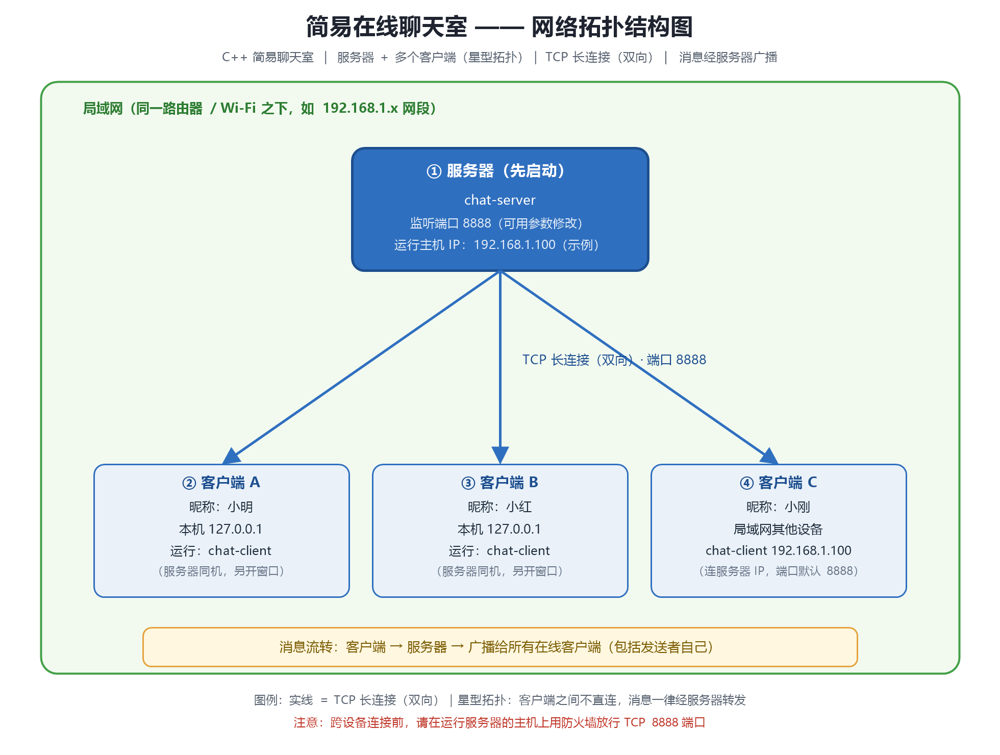
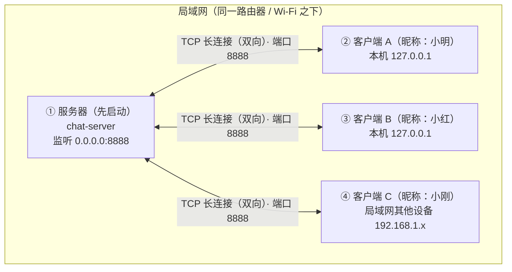

# 简易在线聊天室 —— 网络拓扑结构图

## 1. 拓扑图（PNG 图片）



> 图片由 `draw-topology.ps1`（Windows + GDI+）生成，想调整配色/布局可改脚本后重新运行：
> `powershell -ExecutionPolicy Bypass -File .\draw-topology.ps1`

## 2. Mermaid 版（GitHub / 支持 Mermaid 的编辑器可直接渲染）



## 3. ASCII 简版

```
┌────────────────────────────────────────────────┐
│                局域网（同一路由器下）                │
│                                                │
│  ┌──────────────────────────────┐               │
│  │  ① 服务器（先启动）             │               │
│  │  chat-server  监听端口 8888   │               │
│  └──────────────┬───────────────┘               │
│                 │  TCP 长连接（双向）              │
│        ┌────────┼────────┐                     │
│   ┌────▼───┐ ┌───▼────┐ ┌─▼─────┐             │
│   │②客户端A │ │③客户端B │ │④客户端C │            │
│   │ 小明     │ │ 小红    │ │ 小刚    │            │
│   │127.0.0.1│ │127.0.0.1│ │其他设备 │            │
│   └────────┘ └────────┘ └───────┘             │
└────────────────────────────────────────────────┘
```

## 4. 拓扑说明

- **结构**：**星型拓扑**。所有客户端只与服务器建立一条 TCP 长连接，客户端之间**没有**直接连接。
- **消息流转**：客户端发送 → 服务器接收 → 服务器**广播**给所有在线客户端（包括发送者自己）。
- **端口**：默认 **8888/TCP**，服务器可用参数自定义（`chat-server 9000`），客户端对应 `chat-client <IP> 9000`。
- **角色要求**：服务器必须先启动（`chat-server`），客户端后启动（`chat-client`）。
- **本机测试**：客户端 A/B 都在同一台电脑（`127.0.0.1`），多开几个终端窗口即可模拟多人。
- **跨设备**：客户端 C 在局域网其他设备上，用 `chat-client 192.168.1.100 8888` 连接服务器 IP；
  首次连接前需在服务器主机的防火墙放行 TCP 8888（Windows：`netsh advfirewall firewall add rule ...`；Linux：`sudo ufw allow 8888/tcp`）。
- **跨互联网**：本聊天室面向局域网；若需跨公网使用，需公网 IP 端口映射或内网穿透（如 frp），且消息为明文，不安全。